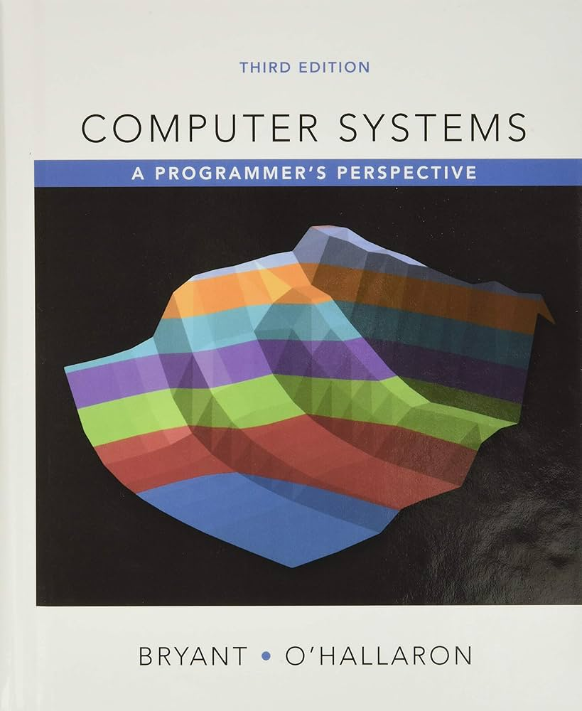
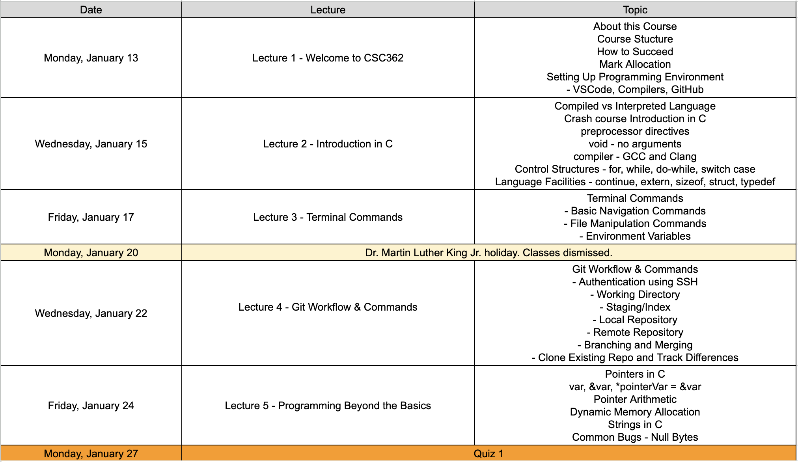
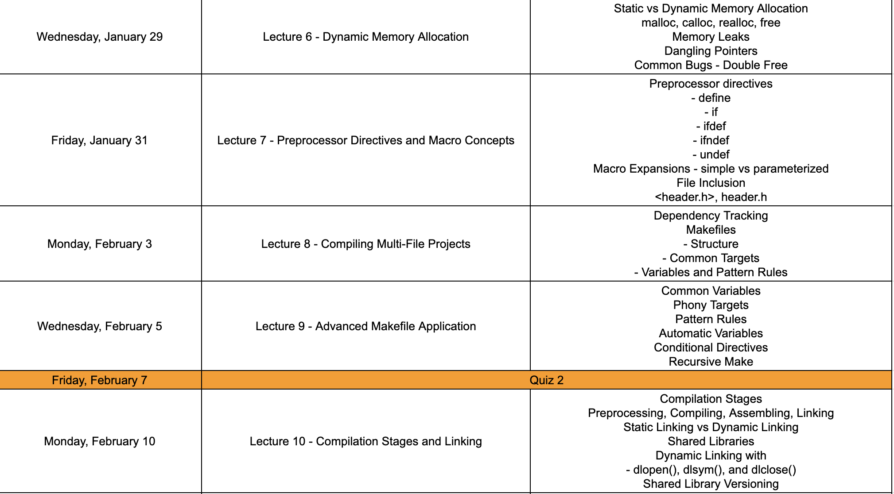
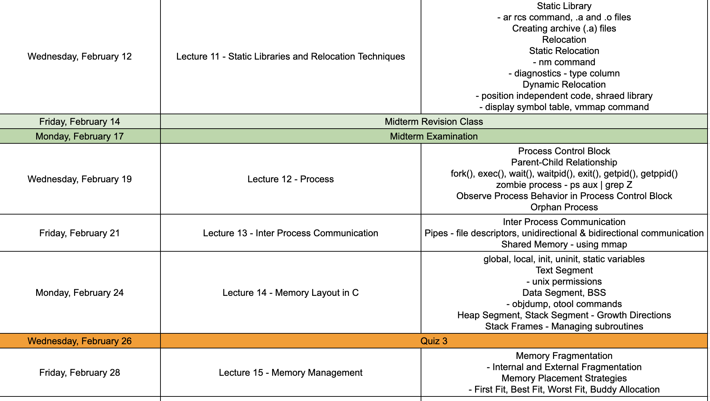
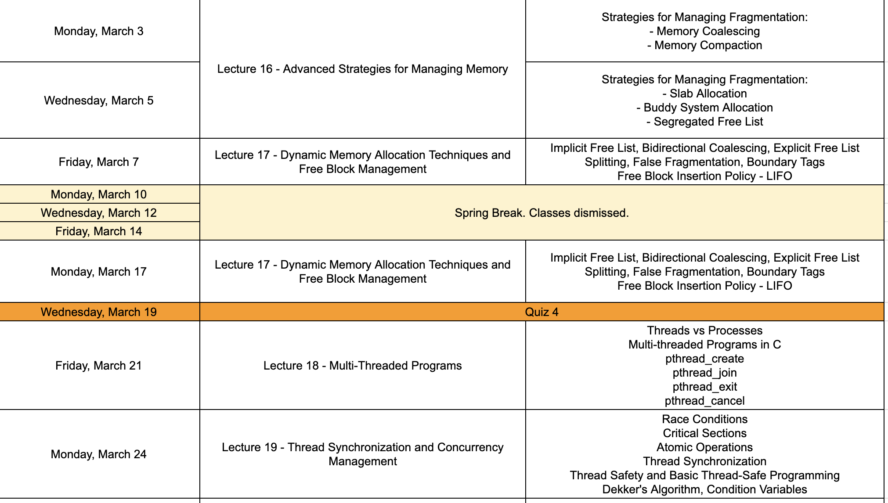
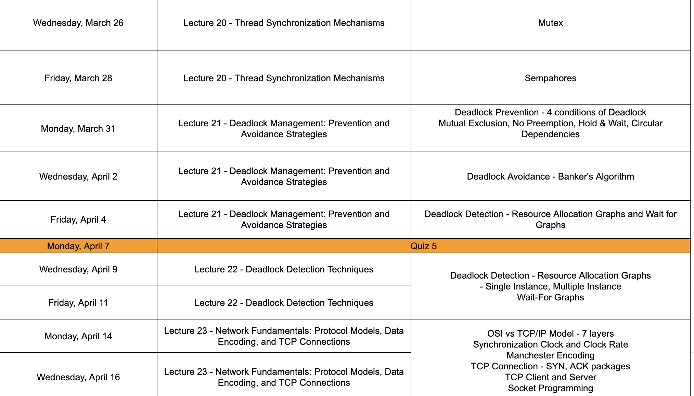
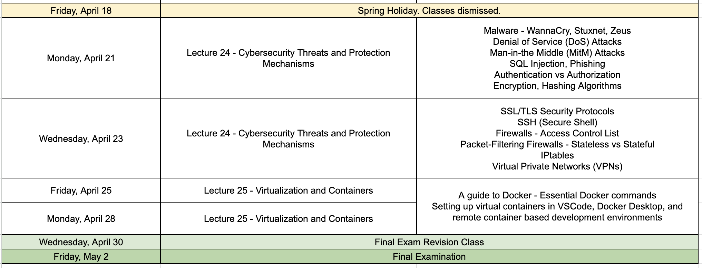

This course will explore key concepts in system-level programming, focusing on the foundational and advanced principles required to build efficient, secure, and robust applications. Topics include terminal commands, Git workflow, C programming fundamentals, dynamic memory allocation, process and memory management, interprocess communication, thread synchronization, and deadlock prevention. Students will also delve into cybersecurity threats, network fundamentals, and virtualization techniques. By mastering these topics through practical implementation and analysis, participants will gain a comprehensive understanding of system programming and its applications in real-world scenarios.

## Instructor and Course Details

Amitabha Dey, a_dey@uncg.edu

Emailing Ettiquete: Email is the best way to reach me. Communication via any other medium is discouraged.

> For the fastest response, include #COURSE_NUMBER #SECTION_NUMBER followed by a word or two describing what your email is regarding in the subject title.

> Some examples: CSC362 Section 1 – Struggling with dynamic memory allocation, CSC362 Section 3 – Difficulty in debugging shared library linking, CSC362 Section 4 – Clarification on preprocessor directives

> Note: Sending email to your professor or teaching assistants should be treated as professional communication. Emails should have an appropriate greeting and ending; students should refrain from using any kind of “shortcuts”, abbreviations, acronyms, slang, etc. in the email text.

Office Location: Petty Science Building 005 [directions]

Drop-In Office hours: By appointment, in-person or virtual. Email to schedule or to check availability.

Course Modality: This course is structured as an entirely in-person experience and is not intended for asynchronous participation. If attending lectures in person is not feasible for you, it is advisable to reconsider enrolling in this class. Attendance is a critical component of the course, as there are points allocated specifically for being present.

## Course Objectives
- Understand the fundamentals of the C programming language, including control structures, data types, and memory management.
- Gain proficiency in using terminal commands for navigation, file manipulation, and environment management.
- Master Git workflow and commands for effective version control, including branching, merging, and repository management.
- Learn the principles of dynamic memory allocation and debugging techniques to resolve issues like memory leaks and dangling pointers.
- Explore the compilation process, including preprocessing, compiling, assembling, and linking, along with static and dynamic linking techniques.
- Develop skills in interprocess communication using pipes, shared memory, and process synchronization techniques.
- Analyze and implement thread synchronization mechanisms, including mutexes, semaphores, and strategies for avoiding race conditions and deadlocks.
- Examine memory layout and management strategies, such as fragmentation handling and free block management.
- Understand basic network programming concepts, including socket programming, TCP connections, and protocol models.
- Learn cybersecurity fundamentals, including threat detection, encryption, and the implementation of protection mechanisms like firewalls and VPNs.

## Textbook and Readings

There is no mandatory textbook for the course. The textbook(s) listed below can be used for supplemental reading.

- Computer Systems: A Programmer's Perspective by Bryant and Hallaron

## Evaluation and Grading

To assess your understanding of the course material and your ability to apply the concepts, the grading structure will include 5 quizzes, 1 midterm exam, and 1 final exam. Each quiz will be worth 10%, collectively accounting for 50% of the total grade. The midterm and final exams will each contribute 20% to your grade, while the remaining 10% will be allocated to attendance and in-class participation.

Attendance is crucial—missing 5 classes will result in a deduction of 1 point per additional absence, up to a maximum of 10 points. Grades will be adjusted at the end of the semester to reflect the overall performance of the class.

Please note that no makeup exams will be provided, and quiz scores will not be dropped. Consistent performance throughout the semester is essential to achieve a strong final grade.

## Mark Allocation and Letter Grade Assignment

<table class="tg">
<tbody>
  <tr>
    <td style="text-align: center" class="tg-amwm">Points Accumulated</td>
    <td style="text-align: center" class="tg-amwm">Letter Grade</td>
    <td style="text-align: center" class="tg-amwm">Grade Point</td>
  </tr>

  <tr>
  <td style="text-align: center" class="tg-baqh">≥ 93</td>
  <td style="text-align: center" class="tg-baqh">A</td>
  <td style="text-align: center" class="tg-baqh">4.0</td>
  </tr>

<tr>
  <td style="text-align: center" class="tg-baqh">90.0-92.9</td>
  <td style="text-align: center" class="tg-baqh">A-</td>
  <td style="text-align: center" class="tg-baqh">3.7</td>
</tr>

<tr>
  <td style="text-align: center" class="tg-baqh">87.0-89.9</td>
  <td style="text-align: center" class="tg-baqh">B+</td>
  <td style="text-align: center" class="tg-baqh">3.3</td>
</tr>

<tr>
  <td style="text-align: center" class="tg-baqh">83.0-86.9</td>
  <td style="text-align: center" class="tg-baqh">B</td>
  <td style="text-align: center" class="tg-baqh">3.0</td>
</tr>

<tr>
  <td style="text-align: center" class="tg-baqh">80.0-82.9</td>
  <td style="text-align: center" class="tg-baqh">B-</td>
  <td style="text-align: center" class="tg-baqh">2.7</td>
</tr>

<tr>
  <td style="text-align: center" class="tg-baqh">77.0-79.9</td>
  <td style="text-align: center" class="tg-baqh">C+</td>
  <td style="text-align: center" class="tg-baqh">2.3</td>
</tr>

<tr>
  <td style="text-align: center" class="tg-baqh">73.0-76.9</td>
  <td style="text-align: center" class="tg-baqh">C</td>
  <td style="text-align: center" class="tg-baqh">1.7</td>
</tr>

<tr>
  <td style="text-align: center" class="tg-baqh">70.0-72.9</td>
  <td style="text-align: center" class="tg-baqh">C-</td>
  <td style="text-align: center" class="tg-baqh">1.3</td>
</tr>

<tr>
  <td style="text-align: center" class="tg-baqh">60.0-69.9</td>
  <td style="text-align: center" class="tg-baqh">D</td>
  <td style="text-align: center" class="tg-baqh">1.0</td>
</tr>

<tr>
  <td style="text-align: center" class="tg-baqh">< 60.0</td>
  <td style="text-align: center" class="tg-baqh">F</td>
  <td style="text-align: center" class="tg-baqh">0.0</td>
</tr>

</tbody>
</table>

## Course Plan

## Course Modification Disclaimer 

This syllabus is intended to give the student guidance on what may be covered during the semester and will be followed as closely as possible. However, as the instructor, I reserve the right to modify, supplement, and make changes as course needs arise. I will communicate such changes in advance through in-class announcements and in writing via this website.

## Academic Integrity Policy

Any incidents of academic dishonesty will be handled strictly, resulting in either a zero on the assignment or an F in the class, depending on the severity of the incident. Any cheating in an online exam, no matter how minor, will result in an automatic F in the class. Significant incidents will be reported to the UNCG Office of Student Rights and Responsibilities. Note that the Department of Computer Science maintains records of all academic integrity incidents, and multiple violations, even in different classes or semesters, will always result in reporting to the university and serious penalties. Students are expected to be familiar with and abide by the UNCG Academic Integrity Policy, which is online at https://academicintegrity.uncg.edu/.

## Attendance Policy
Attendance is mandatory for this course, as consistent participation is crucial for mastering the material. Students who routinely miss classes without prior notice or a valid explanation will face penalties, which may include deductions from their attendance and participation grade. If you anticipate being absent, please inform me in advance and provide an appropriate reason to avoid penalties. Regular attendance is not only a requirement but also essential for staying on track with the course content and assignments. Please see UNCG Attendance Policy for more information.

## Canvas Announcements
Communication includes Announcements in Canvas, and individual emails. You should be ready to RECEIVE the following types of messages. You will receive regular communication via the Announcements on the course Canvas site that is intended for all students regardless of your group. Check these each time you access the course in Canvas to be sure you are up to date with the latest information (these are time-stamped so if you know when you logged in last, you can determine if anything is new).

## Accommodations/ADA Statement
UNCG seeks to comply fully with the Americans with Disabilities Act (ADA). Students requesting accommodations based on a disability must connect with the Office of Accessibility Resources and Services (OARS) at 215 Elliott University Center, (336) 334-5440, oars.uncg.edu.

The University of North Carolina at Greensboro respects and welcomes students of all backgrounds and abilities. If you encounter any barriers to full participation in this course due to the impact of a disability/condition impacting a major life activity, please contact the Office of Accessibility Resources and Services (OARS). OARS will engage students in an interactive process to determine the need for any reasonable accommodations.

Connect quickly via a brief Welcome Form. Upon receipt, OARS will contact you to schedule a convenient, virtual consultation. You may also request a consultation by calling (336) 334-5440, emailing oars@uncg.edu, or walking into the OARS suite at 215, EUC. Additional OARS info may be found at oars.uncg.edu.

If you would like to take the exam in the University Proctoring Lab (UPL), please notify me at least five business days prior to the exam date. This will allow sufficient time to make the necessary arrangements and ensure a smooth testing experience. Be sure to provide your full name, course details, and the specific exam you are requesting to take at the UPL when reaching out. Timely communication is essential to avoid scheduling conflicts or delays.

## Technical Support
Students with technical issues with the course and email should contact 6-TECH for support either by email, phone or chat ( 6TECH Help). Please also make your instructor aware of the issue and if there will be any delays in resolving the issue.

## Inclusive Community
UNCG values diversity and inclusion. Regardless of age, disability, ethnicity, race, gender, gender identity, sexual orientation, socioeconomic status, geographic background, religion, political ideology, language, or culture, we expect all members of this class to contribute to a respectful, welcoming, and inclusive environment for every other member of our class. If aspects of this course result in barriers to your inclusion, engagement, accurate assessment, or achievement, please notify me as soon as possible.

## Religious Obligation Statement
It is expected that instructors will make reasonable accommodations for students who have conflicts due to religious obligations. Please make arrangements with the instructor in advance of any conflict. For more information on UNCG’s Religious Obligations policy, visit: UNCG's Religious Obligations Policy.

## Mental and Physical Health
Health and well-being impact learning, access, and academic success. Throughout your time at the university, you may experience a range of concerns that can cause barriers to your academic success. These might include illnesses, strained relationships, anxiety, high levels of stress, alcohol or drug dependency, crime victimization, feeling down, loss of motivation, or death of a loved one. Student Health Services, the Counseling Center, the Campus Violence Response Center, and the Spartan Recovery Program are here to help.

Anna M. Gove Student Health Center: 107 Gray Drive; (336) 334-5340
Counseling and Psychological Services: 107 Gray Drive; (336) 334-5874 (24/7); https://shs.uncg.edu/cc
Campus Violence Response Center: 107 Gray Drive; (336) 334-9839; https://cvrc.uncg.edu/
Spartan Recovery Program (support service for students in recovery from alcohol and other drug addiction): 107 Gray Drive; (336) 209-9388; srpepic@uncg.edu https://shs.uncg.edu/srp

## Title IX
UNCG is committed to fostering a safe, productive, learning environment. Title IX and our school’s policy prohibit discrimination on the basis of sex. Sexual harassment, which includes gender-based harassment, domestic and dating violence, sexual assault, and stalking, is prohibited. We encourage anyone who has experienced sexual harassment to speak with someone and get the support and resources they need. I, because of my role with the University, am not required to share information with the University’s Title IX Coordinator. Please be aware that if you share a situation related to interpersonal violence with an Official with Authority, they are required to share that information with the University’s Title IX Coordinator.

UNCG has confidential staff members trained to support students in navigating campus life, understanding reporting options, accessing health and counseling services, and more. Confidential support services include: Campus Violence Response Center (CVRC) located on the ground floor of Gove Student Health Center or UNCG’s Medical Clinic, Wellness Center, and Counseling Center located in the Gove Student Health Center.

If you wish to report sexual harassment or have questions about school policies and procedures regarding sexual harassment, please contact our school’s Title IX Coordinator, Murphie Chappell at (336) 256-0362 or mechappe@uncg.edu.
For more information, see this page: https://titleix.uncg.edu/

## Name and Pronoun Use
If your name does not match the name on my class roster, please let me know as soon as possible. My pronouns are [she/her; he/him; they/them]. I welcome your pronouns if you would like to share them with me. For more information about pronouns, see this page: https://pronouns.org/what-and-why

## Elasticity Statement
The instructor intends that this syllabus and course calendar will be followed as outlined, however, as the need arises there may be adjustments to the syllabus and calendar. In such cases, the instructor will notify the students in class and via e-mail with an updated syllabus and calendar within a reasonable timeframe to allow students to adjust as needed.

## Adverse Weather
In cases of inclement weather that impacts this course and course schedule, details can be found:

In your University email: UNCG sends out Adverse Weather updates.
In the UNCG Mobile App: You can set it to provide you alerts.
Via television announcements: UNCG makes weather announcements available on five local stations (WFMY-2, WGHPV, WXII-TV, WXLV-TV, and Spectrum News).
Visit Spartanalert.uncg.edu or the UNCG homepage: UNCG posts up-to-date information on the main University website (uncg.edu) and on the main Spartan Alert page ( spartanalert.uncg.edu).
